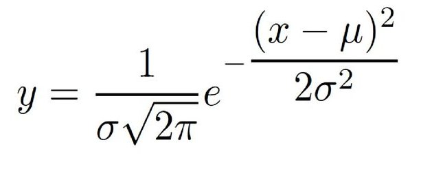

# Naive-Bayes
Naive Bayes is a family of probabilistic algorithm that takes an advantage of probability theory and Bayes theory to predict the category of samples.

* P(c|x) is the posterior probability of class (target) given predictor (attribute). 
* P(c) is the prior probability of class. 
* P(x|c) is the likelihood which is the probability of predictor given class. 
* P(x) is the prior probability of predictor.

### Gaussian Probability Density Function

## Problem
This problem is comprised of 768 observations of medical details for Pima indians patents. The records describe instantaneous measurements taken from the patient such as their age, the number of times pregnant and blood workup. All patients are women aged 21 or older. All attributes are numeric, and their units vary from attribute to attribute.

#### Fields description:

preg = Number of times pregnant

plas = Plasma glucose concentration a 2 hours in an oral glucose tolerance test

pres = Diastolic blood pressure (mm Hg)

skin = Triceps skin fold thickness (mm)

test = 2-Hour serum insulin (mu U/ml)

mass = Body mass index (weight in kg/(height in m)^2)

pedi = Diabetes pedigree function

age = Age (years)

class = Class variable (1:tested positive for diabetes, 0: tested negative for diabetes)

## Process

1) Split the data and the labels and split them further into 'train' and 'test'.
2) Feed the train data to the Naive Bayes model.
3) Split the training data by label.
4) Calculate mean and standard deviation for every attribute for every class.
5) Calculate the probability of a given continuous attribute belonging to each class using Gaussian Probability Density Function. - `P(x|c)`
6) Calculate the class prior probability. - `P(c)`
6) Predict by applying the Bayes rule to the test data for all classes. Note: The denominator is the same in all classes so it is ignored. - `P(x)`
7) Predict the class with highest probability.
8) Calculate accuracy on test data.

## References

[1] https://www.saedsayad.com/naive_bayesian.htm

[2] https://www.codingame.com/playgrounds/6734/machine-learning-with-java---part-5-naive-bayes

[3] https://machinelearningmastery.com/naive-bayes-classifier-scratch-python/

[4] https://chrisalbon.com/machine_learning/naive_bayes/naive_bayes_classifier_from_scratch/